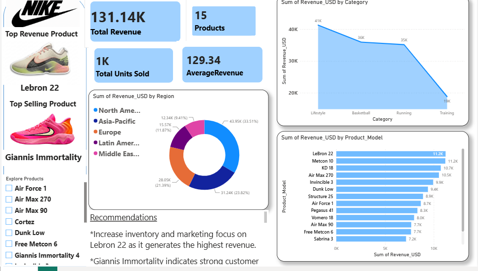

# Global Sales Performance Analysis

**Business Analytics Project | Power BI + Excel**

## Overview

Analyzed a global sales dataset containing **700 order-level transactions** across **21 countries, 5 regions, 3 sales channels, 15 products, and 4 product categories** using **Excel and Power BI** to understand overall sales performance, product performance, category contribution, and regional revenue.

The project focuses on turning sales data into **business insights and actionable recommendations**.

## Business Problem

**Which products, categories, and regions are driving the strongest sales performance, and where should the business focus its attention to improve overall sales?**

## Key Business Questions

1. **Which product categories generate the highest revenue?**
2. **Which product models contribute the most revenue?**
3. **Which regions are the strongest revenue contributors?**
4. **Which products have the strongest sales performance?**
5. **What does the overall sales performance look like across key business KPIs?**

## Key KPIs

| **KPI**                           |              **Result** |
| --------------------------------- | ----------------------: |
| **Total Revenue**                 |            **$131.14K** |
| **Total Products**                |                  **15** |
| **Total Units Sold**              |                  **1K** |
| **Average Revenue**               |             **$129.34** |
| **Highest Revenue Category**      |           **Lifestyle** |
| **Highest Revenue Product Model** |           **LeBron 22** |
| **Top Selling Product**           | **Giannis Immortality** |
| **Top Revenue Region**            |       **North America** |

## Analysis & Key Findings

### 1. Category Performance

* **Lifestyle** generated the highest revenue among the analyzed product categories.
* This makes Lifestyle the strongest category in terms of revenue contribution.
* The result can help guide inventory planning, promotional focus, and category-level investment.

### 2. Product Model Performance

* **LeBron 22** generated the highest revenue among product models.
* This indicates strong revenue contribution from the product model and makes it a useful product for further performance analysis.

### 3. Regional Performance

* **North America** generated the highest revenue among the five regions.
* The region represents the strongest geographic market in the analyzed dataset.

### 4. Top-Selling Product

* **Giannis Immortality** was identified as the top-selling product based on the dashboard's sales measure.
* Comparing top-selling products with highest-revenue products provides a broader view of product performance.

### 5. Overall Sales Performance

* The dataset generated **$131.14K in total revenue** across **1K units sold and 15 products**.
* The dashboard provides an executive-level view of the strongest-performing products, categories, and regions.

## Key Recommendations

1. **Strengthen the Lifestyle category**

   * Continue monitoring the category's performance and explore opportunities around inventory, promotions, and product availability.

2. **Learn from high-performing product models**

   * Analyze what is driving strong revenue from products such as **LeBron 22** and apply relevant learnings to other product models.

3. **Maintain focus on North America**

   * Continue monitoring the region while identifying opportunities to improve performance in other markets.

4. **Support high-selling products**

   * Ensure strong-selling products such as **Giannis Immortality** have sufficient inventory and visibility.

5. **Evaluate products using multiple metrics**

   * Compare revenue, units sold, and other available KPIs rather than relying on a single measure when making product decisions.

## 📊 Power BI Dashboard

An interactive Power BI dashboard was created to visualize sales performance across **products, categories, and regions**.

### Dashboard Preview

## Tools

* **Microsoft Excel**
* **Power BI**

## Skills Demonstrated

**Data Cleaning • KPI Analysis • Sales Analysis • Product Analysis • Category Analysis • Regional Analysis • Data Visualization • Dashboard Development • Business Insights • Business Recommendations**
